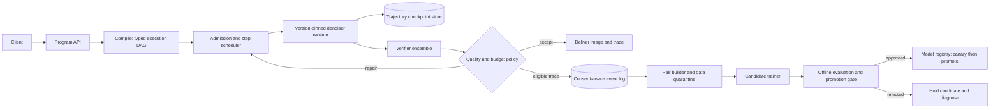

# Design iteration: a quality-gated diffusion improvement fabric

## Decision

Build an **image-generation control plane** that can execute a verifier-guided
generation program, learn from *eligible* served samples, and safely promote a
new policy. Do not start by building a cross-request activation cache.

This keeps the project's interesting thesis — serving produces the evidence for
improvement — while separating three concerns which the first design joined too
tightly:

1. **Serving correctness:** a request must always receive an image from a
   pinned, reproducible model configuration.
2. **Quality scaling:** extra samples and localized repair are optional program
   branches, governed by a request budget and a quality target.
3. **Weight improvement:** candidate training and production promotion are
   asynchronous, reversible control-plane actions. They are never an implicit
   side effect of an individual request.

The central research question becomes measurable: *can a verifier-gated loop
reduce the compute required to meet a fixed quality target, without degrading a
frozen evaluation suite or user-facing reliability?*

## Why change the original design

The SGLang analogy remains useful at the **program and scheduler** levels: a
frontend exposes multi-stage work, and a runtime batches compatible work.
RadixAttention is not, however, a direct architectural template for a
cross-prompt diffusion cache. A token prefix is an exact input dependency. An
activation from a different prompt or seed is an approximate model
intervention; a cache hit may silently alter composition or prompt adherence.
TeaCache-style reuse is valuable evidence for *within-trajectory* approximation,
but does not yet justify a shared fuzzy cache as the engine's foundational
abstraction.

So cache work is an experiment behind a quality contract, not a prerequisite to
the system. The initial serving primitive is an **exact trajectory checkpoint**:
the latent, scheduler state, RNG state, and immutable generation specification
needed to resume the same request. It enables repair, retries, and branch
search without changing semantics.

## Target architecture



### Data plane

The data plane owns request execution only.

- **Program compiler:** turns a small, typed DSL into a DAG with explicit
  branches, maximum cost, and permitted data use. The first four nodes are
  `sample`, `score`, `repair(mask)`, and `choose`.
- **Admission controller:** classifies requests by immutable compatibility key:
  model revision, denoiser architecture, precision, resolution bucket,
  scheduler family, step count, guidance mode, and node type. Only identical
  keys batch in v0.
- **Step scheduler:** runs ready nodes from compatible programs in continuous
  batches. It optimizes queueing and batching without reordering dependencies
  within one trajectory.
- **Trajectory checkpoint store:** persists resume-capable state at configured
  boundaries. It has TTL and per-tenant quotas; it is not a global semantic
  cache.
- **Verifier ensemble:** returns a structured report, not a scalar: global
  confidence, text/image alignment, artifact probabilities, region masks,
  uncertainty, and verifier/model versions.
- **Quality policy:** decides accept, retry, localized repair, fallback, or
  abstain. It enforces both a hard user budget and a global latency budget.

The request result contains the selected image plus a trace ID, model version,
program version, actual compute spent, and verifier decision. That provenance
makes an apparent quality gain debuggable.

### Control plane

The control plane may consume events but cannot mutate an in-flight request.

- **Event log:** write-once records with consent/data-retention status,
  prompt class, candidate metadata, verifier report, selected outcome, and
  user feedback when available. Raw images and prompts are separately governed
  and can be absent from the training record.
- **Pair builder:** constructs a pair only when the same prompt specification,
  policy lineage, and evaluation rules are known. It records why the winner won
  and quarantines low-confidence or near-tie examples.
- **Candidate trainer:** trains against a fixed reference revision. It produces
  an immutable candidate artifact plus its exact dataset snapshot, code/config
  digest, and training metrics.
- **Promotion controller:** owns the only route to production. It runs offline
  gates, then a shadow/canary comparison, and supports immediate rollback by
  changing the registry pointer.

## Generation programs

The DSL should describe policy, not arbitrary Python. This makes scheduling,
cost accounting, and auditing possible.

```python
program = (
  sample(model="base@r17", steps=24, seed=Seed.user(), checkpoint_at=[12])
  .score(with_="critic@r6")
  .when("report.uncertainty < 0.20 and report.quality < 0.78")
    .repair(mask="report.mask", candidates=2, max_extra_steps=12)
    .score(with_="critic@r6")
    .choose(by="quality", tie_break="alignment")
  .otherwise().accept()
  .emit_trace(training_consent="opt_in")
)
```

Compile-time requirements: no unbounded loops, every branch has a maximum
sample/step budget, every model and verifier resolves to a version, and repair
declares its mask source. Runtime policy may decline a branch if SLO or tenant
quota would be exceeded.

Localized repair is deliberately a **capability**, not an assumption: v0 may
implement whole-image best-of-N behind the same interface. A repair backend is
enabled only after seam rate, alignment, and human preference beat its
whole-image baseline at equal compute.

## Learning loop and its gates

Self-play is a source of candidate data, not proof that an update is good.
Diffusion-DPO establishes a preference-optimization formulation for diffusion,
and SPIN-Diffusion motivates competing against an earlier checkpoint; neither
removes the need for independently measured promotion criteria. See the
primary papers: [Diffusion-DPO](https://arxiv.org/abs/2311.12908) and
[SPIN-Diffusion](https://arxiv.org/abs/2402.10210).

An event is training-eligible only if all are true:

1. the user/tenant permitted the configured data use;
2. the generation and verifier traces are complete and versioned;
3. winner/loser separation exceeds a calibrated margin and verifier uncertainty
   is below a threshold;
4. it is not a safety, privacy, duplicate, or out-of-distribution quarantine;
5. its prompt family is within a capped sampling quota, preventing traffic mix
   from becoming the training distribution.

Promotion is a state machine, not a threshold in the scheduler:

```text
collect -> quarantine/filter -> train candidate -> offline gate
        -> shadow -> small canary -> promote
                     |                 |
                     +---- rollback <--+
```

The offline gate requires all of the following against the current production
revision and a fixed holdout set:

- statistically credible human or trusted external-judge preference gain;
- no regression beyond tolerance on prompt adherence, safety, diversity, or
  demographic/slice coverage;
- no improvement only in the training critic's score; use at least one frozen,
  independently trained evaluator and periodic human audits;
- equal or lower expected compute to reach the declared quality target;
- reproducibility of the candidate from its immutable data/config manifest.

The canary repeats these checks on recent traffic in shadow mode. A significant
fall in acceptance, safety, latency, or independent-evaluator score freezes
promotion and restores the last registry pointer automatically.

## Metrics that decide whether the project works

Report a quality/cost frontier, not a single reward:

| Dimension | Required measure |
|---|---|
| Quality | blinded pairwise preference, prompt adherence, artifact rate, diversity |
| Verifier health | calibration, abstention rate, human agreement by slice, drift versus frozen set |
| Improvement | delta versus pinned baseline on frozen holdout and recent shadow traffic |
| Efficiency | p50/p95 latency, GPU-seconds/image, steps-to-target, batch fill, checkpoint memory |
| Safety/reliability | policy violation rate, rollback count, trace completeness, fallback rate |
| Learning data | eligibility rate, quarantine reasons, pair-margin distribution, prompt-family coverage |

The north-star experiment fixes a quality threshold and measures GPU-seconds
per accepted image over successive approved revisions. If quality rises only by
spending more search compute, it is test-time scaling, not evidence of
self-improvement.

## Delivery sequence

### Phase 0 — evaluation before adaptation

Create a versioned prompt suite, a small independently human-labeled set, a
trace schema, and a single-model baseline. Calibrate the critic and implement
abstention. Exit only when metric collection and a deliberately bad candidate
are rejected by the gate.

### Phase 1 — deterministic serving substrate

Implement `sample` and `score`, compatibility-key batching, trace emission,
and exact trajectory checkpoints. Do not add training or approximate caching.
Exit when replaying a trace produces the same result within declared numerical
tolerance and SLO metrics are reliable.

### Phase 2 — quality policy

Add bounded best-of-N, then repair behind an A/B flag. Compare full re-sampling
with repair at matched GPU budget. Exit only if repair improves the
quality/cost frontier and does not create unacceptable seams or prompt drift.

### Phase 3 — shadow learning loop

Build consent-aware events, quarantine, pair construction, immutable candidate
manifests, and offline gate. Candidates remain shadow-only. Exit when a
synthetic critic-hacking candidate and a distribution-collapse candidate are
both blocked for the intended reasons.

### Phase 4 — controlled promotion

Add model registry, canary routing, automatic rollback, and an operator
approval policy. Only now permit self-play updates to serve a fraction of
traffic.

### Phase 5 — cache research track

Benchmark TeaCache-like *per-trajectory* reuse first. Any cross-request
approximation must be opt-in, keyed by an explicitly measured compatibility
class, tested against an exact execution baseline, and disabled automatically
when quality error exceeds its contract. It must not share raw tenant data.

## Repository shape

```text
src/
  api/          typed program DSL, compiler, request/result schemas
  engine/       admission, compatibility buckets, step scheduler, checkpoints
  runtime/      version-pinned denoiser and repair backends
  verifiers/    ensemble adapters, calibration, mask/uncertainty schema
  policy/       quality/budget decisions and fallback rules
  events/       consent-aware trace/event writer and retention controls
  learning/     pair builder, quarantine, trainer, immutable manifests
  promotion/    offline gate, shadow, canary, registry, rollback
  eval/         frozen suites, human-eval tooling, quality/cost reports
  experiments/  reproducible configurations and benchmark results
```

`engine/` must have no dependency on `learning/` or `promotion/`. It may emit
events. This one-way boundary is the important correction: operating the system
still closes the learning loop, but serving remains safe when training is
disabled, slow, or wrong.

## Explicit non-goals

- Video, general vision, and multi-tenant cross-request latent reuse.
- Unattended weight updates with no holdout, shadow, or rollback path.
- Treating a single learned critic as ground truth.
- Claiming a cache is an optimization before its end-to-end quality/cost curve
  beats exact execution.

## First implementation milestone

Produce one end-to-end, reproducible trace for a pinned image model:
`sample -> checkpoint -> score -> bounded second sample -> choose -> emit
trace`. It should run with training disabled, write a complete schema-validated
event, and generate the quality/cost report for a fixed prompt set. That small
vertical slice de-risks the scheduler, verifier contract, provenance, and
evaluation harness before the project takes on self-play or cache novelty.
