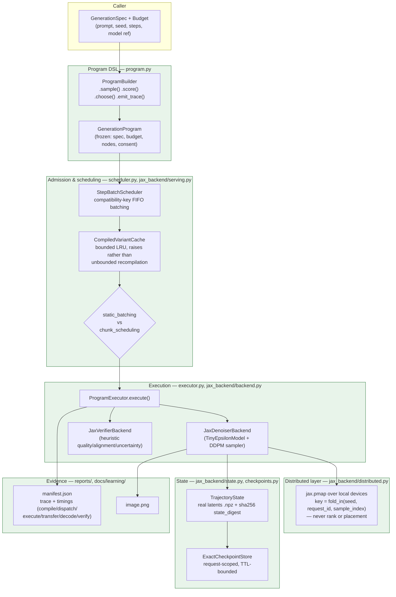
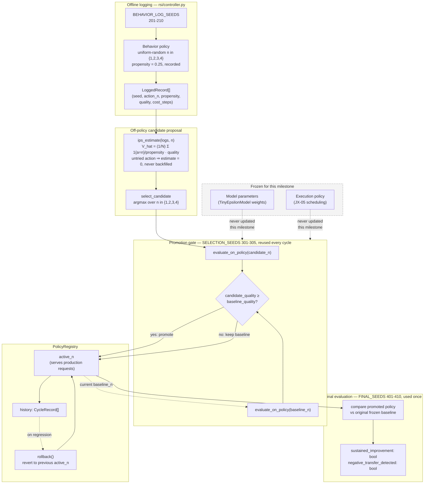

# Architecture diagrams

Three views of what's actually implemented (JX-01 through JX-07), not an
aspirational sketch of the full charter. Each diagram cites the module it
describes so it can be checked against real code, not just read as prose.

## 1. Inference system (JX-01, JX-02, JX-04, JX-05)

One request's path from program compilation through distributed/serving
execution to evidence output.

**What this leaves out on purpose**: no intra-request tensor/sequence
sharding (JX-04 explicitly defers it -- the model is too small to warrant
it), no Pallas/vendor kernel dispatch layer (JX-03 measured that XLA's
default fusion already covers the one exercise tried), no real multi-host
topology (everything above the `Dist` box has only been run on a single
host, CPU or one T4).

## 2. Self-improving loop (JX-06, JX-07)

How a serving decision (which best-of-N split to use) gets proposed,
gated, and possibly rolled back -- without ever touching model weights.

**The load-bearing property**: `FINAL_SEEDS` never appears anywhere in
`Behavior`, `Estimate`, or `Gate` -- candidate search and promotion decisions
are made entirely without seeing the seeds the final claim is judged on
(`tests/test_rsi_controller.py::test_final_evaluation_uses_only_final_seeds_not_selection_or_behavior_seeds`).

## 3. Total design: charter layers vs. what's actually built

The charter's own architecture table (issue #5, section 2), annotated with
which JX milestone implements each layer and how completely.

```mermaid
flowchart LR
    subgraph L1["Model/sampler contract"]
        L1A["types.py: GenerationSpec, ModelRef, Budget"]
        L1B["jax_backend/model.py: TinyEpsilonModel"]
        L1C["jax_backend/sampler.py: DDPM, fold_in RNG discipline"]
    end

    subgraph L2["Compiled execution"]
        L2A["jax_backend/benchmark.py:\ncompile/dispatch/execute/transfer\nseparated & synchronized (JX-02)"]
    end

    subgraph L3["Kernel dispatch"]
        L3A["benchmarks/modal/jx03_gpu_internals.py\nelementwise fusion, tiled GEMM,\nNumPy correctness oracle (JX-03)"]
        L3B["⚠ Nsight Compute traces: NOT captured\n(no privileged perf-counter access)"]
    end

    subgraph L4["Distributed executor"]
        L4A["jax_backend/distributed.py\npmap, placement-invariant RNG,\ncollective latency sweep (JX-04)"]
        L4B["⚠ real multi-host, rank failure: NOT exercised"]
    end

    subgraph L5["Request scheduler"]
        L5A["scheduler.py: StepBatchScheduler (#2)"]
        L5B["jax_backend/serving.py:\nCompiledVariantCache, static vs\nchunk scheduling, p50/p95/p99 (JX-05)"]
    end

    subgraph L6["State store"]
        L6A["jax_backend/state.py: TrajectoryState,\nreal checkpoint/resume, integrity-checked (JX-01)"]
        L6B["checkpoints.py: ExactCheckpointStore (#2)"]
    end

    subgraph L7["Quality/search controller"]
        L7A["eval/quality_compute.py: frozen\nquality/compute protocol (JX-02)"]
        L7B["eval/adaptive_inference.py:\nsingle/more-steps/best-of-N/adaptive,\ndisjoint held-out eval (JX-06)"]
    end

    subgraph L8["Improvement controller"]
        L8A["rsi/controller.py: IPS off-policy\nestimation, promotion gate,\nPolicyRegistry.rollback() (JX-07)"]
        L8B["⚠ model-parameter training: NOT attempted"]
    end

    subgraph L9["Evidence layer"]
        L9A["reports/*.json: raw evidence per milestone"]
        L9B["docs/learning/*.md: findings,\nincluding kept negative results"]
    end

    subgraph L10["Not started"]
        L10A["JX-08: video workload,\nsecond accelerator qualification"]
    end

    L1 --> L2 --> L3 --> L4 --> L5 --> L6
    L6 --> L7 --> L8 --> L9
    L9 -.-> L10

    classDef done fill:#e8f4ea,stroke:#2f7a3d;
    classDef partial fill:#fff6e0,stroke:#b8860b;
    classDef todo fill:#fbe9e9,stroke:#b33;
    class L1,L2,L6,L9 done;
    class L3,L4,L5,L7,L8 partial;
    class L10 todo;
```

**Reading the color coding**: green layers have no known open gaps at their
current (tiny-model, single-host) scope. Amber layers work and are tested
but have an explicitly documented gap (no Nsight traces, no real multi-host,
no model-parameter training, etc.) -- the gap is named in the corresponding
`docs/learning/*.md` file, not implied to be closed. Red is simply not
started.
